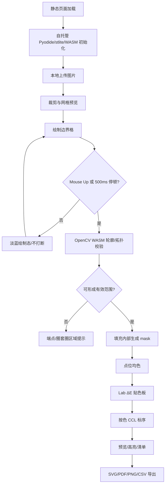

# 拼豆图生成器（Pingdou）— 需求文档 v0.7

> 状态：静态化架构重构定稿（stlite / WebAssembly / Cloudflare Pages / 自托管资源）  
> 技术方向：**纯前端静态网页 + WebAssembly + stlite（Serverless Streamlit）**  
> 运行边界：所有图片处理、围圈识别、颜色转换、标序、导出均在用户本地浏览器执行；**无 Python 后端、无图片上传、无服务器 CPU 成本**  
> 更新日期：2026-07-13

---

## 1. 产品一句话

上传图片 → 浏览器本地初始化 WASM Python → 裁剪 + 方格叠加预览 → **涂边界围圈（8 连通闭合）** → **OpenCV WASM 轮廓生成 mask** → 点位色图 → 色板转换 → **分色前缀 + 局部连通块标序** → 彩色/分色高亮图纸 → **SVG / PDF 无损矢量 + 高清 PNG + CSV** 导出。

核心价值：
- **隐私**：图片、工程数据、导出文件均不离开用户浏览器。  
- **成本**：静态资源托管，无后端计算实例，无排队任务。  
- **稳定**：Cloudflare Pages + CDN + DDoS 缓解；关键 WASM / wheel 资源本地自托管，避免外部 CDN 波动。  
- **拼装友好**：按颜色集中拼装；标签形如 `A-1` / `A01-1`，深浅底色自适应文字灰度。  

---

## 2. 主流程

```text
① 首次访问
   ├─ 加载静态 HTML/CSS/JS
   ├─ 展示 WASM 初始化进度条与隐私告知
   └─ 从本站静态目录加载 Pyodide / stlite / whl（不访问外部 CDN）

② 上传图片（本地 File API，仅浏览器内存读取）
③ 矩形裁剪
④ 设置方格精度 W×H
⑤ 背景 + 方格叠加预览（定精度；不定色、不标序）
⑥ 涂边界围圈
      · 涂的是边界格；边界 ∈ 有效范围；内部自动有效
      · 拖拽中只做轻量实时渲染，不做强闭合拦截
      · Mouse Up 或停顿 500ms 后静默闭合/拓扑校验
      · 未涂 → 默认整板（四边为界）
      · 自绘后 → 取消四周默认，仅认用户圈
      · 多圈：允许相切、相交、共享边界；仅禁止“圈套圈”（完全嵌套）
⑦ 确认 mask
      · boundary_cells → 二值图
      · cv2.findContours 提取轮廓树 Hierarchy
      · cv2.drawContours(..., FILLED) 生成有效 mask
      · 外部毛刺按噪声忽略或并入最近有效区域
⑧ 点位色图（格内均色 RGB）
⑨ 颜色转换（RGB → Lab；ΔE 最近色板色号）
⑩ 分色连通块标序（每色独立 8 邻域 CCL，标签形如 A-1 / A01-1）
⑪ 彩色总览 / 分色高亮 / 用量清单 / 块清单
⑫ 导出：SVG + PDF（无损矢量）+ 高清 PNG + CSV + 工程 JSON（可选）
```



---

## 3. 决策汇总（累积 + v0.7 新增）

| 项 | 决策 |
|----|------|
| 架构方向 | **纯前端静态网页**；基于 **stlite + Pyodide/WebAssembly** 运行 Python/Streamlit；不建设动态 Python 后端 |
| 计算位置 | 裁剪、点位均色、OpenCV 轮廓、颜色转换、CCL 标序、SVG/PDF/PNG/CSV 导出均在浏览器本地完成 |
| 隐私边界 | 图片不上传；默认不落盘；工程 JSON 仅用户主动下载/导入 |
| 托管 | Cloudflare Pages 托管纯静态 HTML/JS/WASM/whl；业务侧无可被打穿的源站 CPU |
| DDoS 防御 | 依托 Cloudflare CDN / DDoS 缓解 / 缓存边缘节点；静态资源可全量缓存，攻击不触发后端计算 |
| 广告挂载 | 在静态 HTML 模板中以客户端 JS 注入 Google AdSense / Ezoic；不影响纯静态部署 |
| 国内网络优化 | **Pyodide 核心库与所有 wheel 依赖必须自托管**；运行时不得从 jsDelivr、GitHub、unpkg 等外部 CDN 拉取关键资源 |
| 围圈 | 涂边界；8 连通闭合；默认四边；自绘去默认；允许 8 字/相切/相交/共享边界；**仅禁止圈套圈** |
| 围圈算法 | **弃用纯 Python 循环 flood fill 主方案**；采用 **OpenCV WASM 原生轮廓/填充管线**：`findContours`/`Hierarchy` 识别圈套圈，`drawContours(FILLED)` 或 OpenCV 原生填充生成 union mask |
| 边缘 Case | 自交“8”字圈、相切圈、共享边界均合法；外部孤立毛刺不触发未闭合报错；仅圈套圈/嵌套洞需要拦截或提示合并 |
| 圈后流程 | 点位色图 → 颜色转换 → 分色标序 → 图纸/清单/导出 |
| 标序邻接 | **8 邻域** |
| **标序形态（v0.7 强化）** | **颜色代号前缀 + 该色局部连通块序号**（如 `A-1`、`A-2`、`B-1`；或 `A01-1`）为默认主模式 |
| 全局序号 | 降为可选辅助模式（排查/总览），非拼装主路径 |
| 字体颜色 | **自适应序号灰度**：浅色豆用 `#303030`；深色豆自动用 `#E0E0E0` 或白色，保障打印可读 |
| 分色高亮 | 按色筛选；所选色正常显示，未选色淡化/隐藏序号 |
| 导出 | **SVG / PDF 无损矢量为 P0**；同时保留高清 PNG、CSV；工程 JSON 可选 |
| MVP 技术依赖 | stlite、Pyodide、本地 wheels：NumPy、Pillow、OpenCV WASM、颜色转换所需轻量库；避免 SciPy 重依赖进入首版 |

---

## 4. 围圈规则与交互体验

### 4.1 围圈业务规则

1. 用户在方格上涂 **边界格**；边界格属于拼豆有效范围。  
2. 围圈目标不是做 CAD 级拓扑约束，而是帮助用户圈定「需要参与染色、标序、导出的拼豆范围」。因此交互应 **容错优先**。  
3. 未涂边界 → 整板有效（默认四边为边界）。  
4. 一旦用户自绘边界 → 去掉默认四边，仅认用户绘制出的有效封闭范围。  
5. 合法形态：
   - 单个闭合圈；
   - 多个独立闭合圈；
   - “8”字圈 / 葫芦形圈：视为两个或多个共享顶点/边界的封闭区域；
   - 多圈相切、相交、局部重叠、共享一段边界；
   - 同一条边界被重复涂抹。  
6. **唯一必须防止的拓扑问题是「圈套圈」**：一个闭合圈完全包住另一个闭合圈，形成嵌套/洞语义。当前产品不支持“挖洞”或“内外层不同语义”，因此需拦截并提示用户擦除内圈或改为共享边界/拆成并列区域。  
7. 圈外 → 白；确认后才进入点位色图、色板转换与标序。  
8. 外部毛刺：闭合圈外伸出的孤立悬空单股线条不应误判为“未闭合”；生成 mask 时按噪声忽略，或并入最近有效边界但不扩大有效范围。  
9. 边界叠加原则：`boundary_cells` 是集合语义，重复涂同一格只算一次；多个闭合区域共享边界时，最终 `mask` 是所有封闭区域的并集。  

### 4.2 实时预览防疲劳（F-BND-04）

| 交互状态 | 行为 | 视觉反馈 | 是否阻断用户 |
|----------|------|----------|--------------|
| 鼠标按下并拖拽中 | 只记录经过的边界格并绘制预览 | 淡蓝色半透明笔迹；不闪红、不弹错 | 否 |
| 拖拽中形成暂时缺口 | 不做闭合强校验 | 仍显示淡蓝提示 | 否 |
| Mouse Up | 触发一次后台静默校验 | 未闭合端点微弱闪烁；不弹窗轰炸 | 否，允许继续补线 |
| 停顿 500ms | 防抖触发轻量校验 | 已闭合则内部淡色填充；冲突处柔和描边 | 否 |
| 点击「确认 mask」 | 执行严格校验 | 仅对圈套圈/无封闭范围等需处理区域高亮并说明 | 是，修复后再确认 |

**原则：** 绘制阶段帮助用户，而不是惩罚用户；确认时也只阻断「圈套圈」或「完全无法形成有效范围」这类真正影响结果的情况。

### 4.3 错误提示文案

| 场景 | 提示文案 | 处理原则 |
|------|----------|----------|
| 未形成任何封闭区域 | `还没有形成可识别的封闭范围，请继续补线或使用默认整板。` | 不弹窗轰炸；端点/断点轻微闪烁 |
| 圈套圈 / 嵌套洞 | `检测到圈套圈：当前版本不支持在一个范围内再挖洞。请擦除内圈，或把它改成与外圈相连/并列的区域。` | P0 拦截；给出一键高亮内圈 |
| “8”字圈 | 不报错；可提示 `已识别为两个相连区域，将一起参与生成。` | 合法，mask 取并集 |
| 多圈相切/共享边界 | 不报错 | 合法，边界集合去重 |
| 外部毛刺 | 不弹错；高级提示 `已忽略闭合圈外的孤立毛刺。` | 容错忽略 |


---

## 5. 算法设计（v0.7）

### 5.1 数据坐标约定

| 名称 | 形状/类型 | 说明 |
|------|-----------|------|
| `grid_w`, `grid_h` | int | 方格宽高，列数/行数 |
| `boundary_cells` | `[(r, c), ...]` | 用户涂过的边界格，行列坐标 |
| `boundary_binary` | `uint8[H,W]` | 边界二值图，边界=255，其它=0 |
| `mask` | `bool[H,W]` | 最终有效拼豆范围，边界+内部=True |
| `rgb_grid` | `uint8[H,W,3]` | 每格均色 RGB |
| `color_grid` | `str/int[H,W]` | 色板映射后的色号 |
| `labels_per_color` | `dict[color, int[H,W]]` | 每种颜色内部的局部连通块 id |
| `display_labels` | `str[H,W]` | 印在图纸上的标签，如 `A-1` |
| `text_color_grid` | `str[H,W]` | 自适应序号颜色，如 `#303030` / `#E0E0E0` |

### 5.2 围圈 mask：OpenCV WASM 容错填充方案（替代纯 Python flood fill）

v0.7 明确摒弃旧的「纯 Python 循环 flood fill」作为生产主路径。原因：
- Python 循环在 Pyodide/WASM 中会被解释执行，复杂边界下延迟更明显。  
- 拼豆用户的目标是快速圈定有效范围，不是绘制数学意义上完美的多边形；算法应接受 8 字、共享边界、重复涂抹等真实操作。  
- OpenCV 的轮廓、层级、连通域与填充能力由 WASM 原生代码执行，更适合浏览器本地计算。  

**核心语义：封闭区域并集（Union of enclosed areas）。**  
只要边界能围出一个或多个封闭区域，这些区域都进入 `mask`；边界相切、相交、叠加不再视为错误。唯一需要拦截的是「圈套圈」导致的嵌套洞语义。

**实现路径：**
1. 将 `boundary_cells` 栅格化为 `boundary_binary`，重复涂抹自动去重。  
2. 对交互预览可执行轻量形态学闭合/去噪，但确认时必须保留用户主边界形状，避免误改范围。  
3. 调用 `cv2.findContours(boundary_binary, cv2.RETR_TREE, cv2.CHAIN_APPROX_SIMPLE)` 提取轮廓与 `Hierarchy`，主要用于识别：
   - 是否存在完全嵌套的子轮廓/洞；
   - 是否只有毛刺而没有可填充区域；
   - 需要高亮提示的内圈。  
4. 合法闭合范围采用 union 填充：
   - 首选：对可填充 contour 使用 `cv2.drawContours(..., thickness=cv2.FILLED)`，多个区域 OR 合并；
   - 备选/兜底：用 OpenCV 原生 `cv2.floodFill` 或 `connectedComponents` 从外部标记 exterior，再取 `interior = not exterior`。这是 OpenCV 原生实现，不是被弃用的 Python 循环 flood fill。  
5. 外部毛刺和孤立噪点不参与闭合区域判断，不触发未闭合报错。  
6. 若检测到圈套圈：默认拦截；后续可提供「合并内圈」按钮，把内圈边界当普通线条并入有效范围。  

```python
import cv2
import numpy as np


def build_mask_with_opencv(boundary_cells, h, w):
    # 空边界：默认整板有效
    if not boundary_cells:
        return np.ones((h, w), dtype=bool), []

    boundary = np.zeros((h, w), dtype=np.uint8)
    for r, c in set(map(tuple, boundary_cells)):
        if 0 <= r < h and 0 <= c < w:
            boundary[r, c] = 255

    contours, hierarchy = cv2.findContours(
        boundary,
        mode=cv2.RETR_TREE,
        method=cv2.CHAIN_APPROX_SIMPLE,
    )

    nested_errors = detect_nested_loops(contours, hierarchy)
    if nested_errors:
        return None, nested_errors

    # 方案 A：轮廓填充并集。8 字/共享边界/叠边均通过 OR 合并。
    filled = np.zeros((h, w), dtype=np.uint8)
    for idx in fillable_contour_indices(contours, hierarchy):
        cv2.drawContours(filled, contours, idx, 255, thickness=cv2.FILLED)

    mask = (filled > 0) | (boundary > 0)

    # 方案 B 可作为兜底：OpenCV 原生 floodFill 标外部，取非外部区域。
    # 注意：这是 cv2 的 C++/WASM 实现，不是 Python 循环。
    # mask = fill_by_exterior_floodfill(boundary)

    return mask, []
```

**性能目标：** 典型 `50×50` 至 `150×150` 网格下，轮廓提取、圈套圈检测与 union 填充应达到毫秒级；复杂多圈也不应出现可感知卡顿。

### 5.3 极端边缘 Case 处理

| Case | 识别方式 | 处理 |
|------|----------|------|
| 空边界 | `boundary_cells == []` | `mask = all True`，默认整板 |
| 正常单圈 | 一个可填充闭合范围 | 填充内部 + 边界 |
| 多个独立圈 | 多个闭合范围 | 分别填充后 OR 合并 |
| 自交“8”字 / 葫芦形 | 闭合范围共享顶点或边界 | **合法**；视为多个相连区域，mask 取并集 |
| 多圈相切/相交 | 边界有交点或共享边界 | **合法**；边界集合去重，区域并集 |
| 重复涂边 | 同一 cell 多次出现 | **合法**；`set(boundary_cells)` 去重 |
| 圈套圈 / 嵌套洞 | `Hierarchy` 出现完全包含，且内圈不与外圈共享边界 | P0 拦截；提示擦除内圈或改成相连/并列区域 |
| 外部毛刺 | 闭合轮廓外有孤立细线，不构成有效填充 | 不报未闭合；生成 mask 时忽略 |
| 细小噪点 | 面积低于阈值或孤立边界格 | 忽略，并在高级日志记录 |

### 5.4 点位色与色板转换

- 对 `mask==1` 的格子：从裁剪后图片对应区域取 RGB 均值或中位数。  
- 对 `mask==0` 的格子：强制白色/透明背景，不参与色板映射与标序。  
- 色板转换：`RGB → Lab → ΔE` 最近色。MVP 可用 CIE76；后续可升级 CIEDE2000。  
- 支持最大颜色数限制、保留白色、禁用默认抖动。  
- 色板必须包含：`code`、`name`、`hex`、`lab`、`sort_order`、`is_dark`（可计算）。  

### 5.5 分色前缀与局部标序算法

拼豆用户真实拼装方式是：**一次拿一种颜色，把该颜色所有区域拼完，再换下一色**。因此默认标序必须围绕颜色组织，而不是全局纯数字。

| 元素 | 规则 | 示例 |
|------|------|------|
| 颜色前缀 | 每个用到的色板色分配稳定代号 | 黑=`A`，红=`B`；或色号 `A01` |
| 局部序号 | 该颜色内部，各 8 连通块按 TB-LR 编 `1..n` | 黑色三块 → `A-1`、`A-2`、`A-3` |
| 显示串 | `{prefix}-{local_id}` | `B-1`、`A01-2` |
| 同块内 | 所有格子显示同一标签 | 相邻同色同号 |

**前缀策略：**
1. **默认推荐：短字母前缀**：按颜色用量降序或首次出现顺序映射 `A,B,C...`，图例显示 `A = 黑色 / #000000 / 色号 A01`。优点是图纸更短、更清晰。  
2. **采购友好模式：色板 code 前缀**：直接显示 `A01-1`、`B03-2`，与买豆/库存色号一致。  
3. 两种模式必须稳定可复现；导出文件中必须包含前缀图例与完整色号。  

```python
import numpy as np
import cv2

NEIGHBOR_8 = 8


def label_per_color(color_grid, mask, prefix_map):
    labels_per_color = {}
    blocks_per_color = {}
    display_labels = np.full(color_grid.shape, "", dtype=object)

    used_codes = sorted(np.unique(color_grid[mask]), key=stable_color_order)

    for code in used_codes:
        binary = ((color_grid == code) & mask).astype(np.uint8)
        # OpenCV connectedComponents 在 WASM 下可复用，避免引入 scipy 重依赖
        n, labeled = cv2.connectedComponents(binary, connectivity=NEIGHBOR_8)

        metas = []
        for raw_id in range(1, n):
            ys, xs = np.where(labeled == raw_id)
            metas.append({
                "raw_id": raw_id,
                "count": int(ys.size),
                "min_r": int(ys.min()),
                "min_c": int(xs.min()),
            })

        # 严格按从上到下、从左到右重排，保证确定性
        metas.sort(key=lambda m: (m["min_r"], m["min_c"]))
        remap = {m["raw_id"]: i for i, m in enumerate(metas, start=1)}

        local = np.zeros_like(labeled, dtype=np.int32)
        prefix = prefix_map[code]
        blocks = []
        for m in metas:
            local_id = remap[m["raw_id"]]
            local[labeled == m["raw_id"]] = local_id
            label = f"{prefix}-{local_id}"
            display_labels[labeled == m["raw_id"]] = label
            blocks.append({**m, "id": local_id, "label": label, "code": code, "prefix": prefix})

        labels_per_color[code] = local
        blocks_per_color[code] = blocks

    return labels_per_color, display_labels, blocks_per_color
```

**全局纯数字模式：** 仅作为 P1 辅助视图，用于调试、总览、统计总块数；不作为默认拼装路径。

### 5.6 自适应序号灰度

序号文字不能固定为 `#303030`。必须根据底层豆子颜色亮度自适应，保证深色豆、浅色豆上都能看清。

```python
def readable_text_color(hex_color: str) -> str:
    r = int(hex_color[1:3], 16)
    g = int(hex_color[3:5], 16)
    b = int(hex_color[5:7], 16)
    # WCAG relative luminance approximation in sRGB space
    luminance = 0.2126 * r + 0.7152 * g + 0.0722 * b
    if luminance < 128:
        return "#E0E0E0"  # 深色豆：浅灰/近白
    return "#303030"      # 浅色豆：深灰
```

| 底色类型 | 示例 | 序号颜色 |
|----------|------|----------|
| 浅色豆 | 白、浅黄、肤色 | `#303030` |
| 中等亮度 | 红、绿、蓝 | 按阈值自动选择；必要时允许描边 |
| 深色豆 | 黑、深蓝、深紫、棕黑 | `#E0E0E0` 或 `#FFFFFF` |

高级渲染可为 `<text>` 添加轻微描边：`stroke="#FFFFFF" stroke-width="0.4"` 或深色底反向描边，但默认不应破坏打印清晰度。

---

## 6. 技术架构与部署

### 6.1 架构原则

| 原则 | 说明 |
|------|------|
| 纯静态 | 构建产物为 HTML/CSS/JS/WASM/whl/图片等静态文件 |
| Serverless Streamlit | 使用 stlite 在浏览器中运行 Streamlit UI 与 Python 算法 |
| Client-side only | 用户图片、mask、色板转换、导出全部在浏览器本地完成 |
| 无后端 CPU | 不提供图片上传 API、任务队列、动态 Python 服务 |
| 可缓存 | 所有核心静态资源可设置长缓存与版本 hash |
| 可广告变现 | 广告脚本在 HTML Shell 客户端挂载，不依赖动态服务 |

### 6.2 目标部署拓扑

```text
用户浏览器
  ├─ HTML Shell / CSS Loading 动画
  ├─ stlite runtime
  ├─ Pyodide WASM Python
  ├─ 本地 wheel：numpy / pillow / opencv-wasm / ...
  └─ 本地算法执行：裁剪、轮廓、色板、标序、导出
        ▲
        │ 静态资源 HTTPS
        ▼
Cloudflare Pages
  ├─ /index.html
  ├─ /assets/app/*.py
  ├─ /assets/pyodide/pyodide.js
  ├─ /assets/pyodide/pyodide.asm.wasm
  ├─ /assets/pyodide/python_stdlib.zip
  ├─ /assets/wheels/*.whl
  ├─ /assets/palettes/*.json
  └─ /assets/vendor/ads/*.js（广告挂载壳，可选）
```

### 6.3 stlite 集成要求

- 页面入口是静态 `index.html`。  
- 通过 stlite 加载本地 Streamlit 应用脚本（如 `/assets/app/main.py`）。  
- Pyodide `indexURL` 必须指向本站本地目录，例如 `/assets/pyodide/`。  
- Python 依赖必须从 `/assets/wheels/` 安装；禁止运行时访问外部 PyPI/CDN。  
- 对体积较大的 wheel 采用版本 hash 与 Brotli/Gzip 压缩。  
- 首次初始化失败时提供「刷新重试 / 下载离线包 / 查看兼容性说明」。  

### 6.4 静态资源自托管规范（国内网络优化 P0）

为适配国内用户可能遇到的 DNS 污染、GitHub 访问受阻、jsDelivr 间歇性断联等问题，v0.7 强制执行 Self-hosting：

| 资源 | 必须本地化 | 建议路径 | 说明 |
|------|------------|----------|------|
| `pyodide.js` | 是 | `/assets/pyodide/pyodide.js` | Pyodide 入口脚本 |
| `pyodide.asm.wasm` | 是 | `/assets/pyodide/pyodide.asm.wasm` | Python WASM 核心 |
| `python_stdlib.zip` | 是 | `/assets/pyodide/python_stdlib.zip` | Python 标准库 |
| Pyodide lock / metadata | 是 | `/assets/pyodide/` | 与版本保持一致 |
| NumPy wheel | 是 | `/assets/wheels/numpy-*.whl` | 点位矩阵/颜色计算 |
| Pillow wheel | 是 | `/assets/wheels/pillow-*.whl` | 图片读取、裁剪、PNG 渲染 |
| OpenCV WASM / wheel | 是 | `/assets/wheels/opencv*.whl` 或 `/assets/vendor/opencv/` | `cv2.findContours` / `connectedComponents` |
| 色板 JSON | 是 | `/assets/palettes/*.json` | 拼豆品牌色板 |
| 字体 | 建议 | `/assets/fonts/` | 导出 SVG/PDF 字体一致性 |
| stlite runtime | 是 | `/assets/stlite/` | 不从外部 CDN 拉取 |

**禁止项：**
- 生产运行时从 `cdn.jsdelivr.net`、`github.com`、`raw.githubusercontent.com`、`unpkg.com`、远程 PyPI 动态拉取关键脚本或 wheel。  
- 因 CDN 失败导致应用白屏。必须存在本地错误 UI 与重试机制。  

**缓存策略：**
```text
/assets/pyodide/*      Cache-Control: public, max-age=31536000, immutable
/assets/wheels/*       Cache-Control: public, max-age=31536000, immutable
/assets/app/*          Cache-Control: public, max-age=3600
/index.html            Cache-Control: no-cache
```

### 6.5 Cloudflare Pages、DDoS 与广告挂载

| 能力 | 要求 |
|------|------|
| 静态托管 | Cloudflare Pages 发布 `dist/`，不需要后端容器 |
| DDoS 防御 | 使用 Cloudflare CDN、缓存、DDoS 托管能力；所有计算在用户端，攻击不会触发服务器算法任务 |
| WAF/限速 | 可对非静态路径、管理路径、广告回调路径设置规则；主静态资源优先缓存 |
| 广告 | 在 HTML 模板中加入异步 Google AdSense / Ezoic loader；广告容器不阻塞 WASM 初始化 |
| 合规 | 广告脚本与隐私文案分离；不把用户图片传给广告/分析服务 |
| 降级 | 广告脚本失败不得影响主应用；广告位保留占位防止布局跳动 |

示例 HTML 结构：

```html
<body>
  <div id="wasm-loading">
    <div class="logo">Pingdou</div>
    <div class="progress"><span id="progress-bar"></span></div>
    <p>正在本地初始化 Python 算力中心，您的图片与数据绝不上传。</p>
  </div>

  <main id="stlite-app"></main>

  <aside class="ad-slot" data-ad="top-banner"></aside>
  <script async src="/assets/vendor/ads/ads-loader.js"></script>
  <script type="module" src="/assets/stlite/bootstrap.js"></script>
</body>
```

---

## 7. 交互功能需求

### 7.1 输入、裁剪、网格

| ID | 需求 | 优先级 | 说明 |
|----|------|--------|------|
| F-IN-01 | 本地上传图片 | P0 | 使用浏览器 File API；不上传服务器 |
| F-IN-02 | 图片格式 | P0 | PNG/JPG/WebP；失败时提示格式不支持 |
| F-CROP-01 | 矩形裁剪 | P0 | 可拖拽裁剪框；保持预览实时 |
| F-GRID-01 | 设置方格 W×H | P0 | 支持常用尺寸预设与自定义 |
| F-GRID-02 | 方格叠加预览 | P0 | 裁剪图上显示网格；此阶段不量化、不标序 |

### 7.2 边界围圈

| ID | 需求 | 优先级 | 说明 |
|----|------|--------|------|
| F-BND-01 | 涂边界格 | P0 | 鼠标/触控绘制，支持橡皮擦 |
| F-BND-02 | 默认整板 | P0 | 未涂时默认全部有效 |
| F-BND-03 | 自绘去默认 | P0 | 一旦绘制边界，默认四边失效 |
| F-BND-04 | 实时预览防疲劳 | P0 | 拖拽中不闭合拦截；Mouse Up/500ms 后静默校验 |
| F-BND-05 | 多圈校验 | P0 | 允许多个独立圈、相切圈、8 字圈、共享边界；仅禁止完全嵌套的圈套圈 |
| F-BND-06 | 8 字/叠边容错 | P0 | “8”字圈视为两个共享边界/顶点的有效区域；边界重复涂抹按一次处理 |
| F-BND-07 | 毛刺容错 | P1 | 外部毛刺不触发未闭合报错 |

### 7.3 分色标序与分色高亮

| ID | 需求 | 优先级 | 说明 |
|----|------|--------|------|
| F-LAB-10 | 分色前缀标签 `{prefix}-{n}` | P0 | 默认主模式，如 `A-1`、`B-2` |
| F-LAB-11 | 色板 code 前缀 `{code}-{n}` | P0 | 采购友好，如 `A01-1` |
| F-LAB-12 | 严格 TB-LR 重映射块号 | P0 | 稳定可复现 |
| F-LAB-13 | 全局 `1..N` 辅助模式 | P1 | 总览/调试 |
| F-VIEW-01 | 图纸必须显色 | P0 | 不能只显示黑白编号 |
| F-VIEW-02 | 自适应序号灰度 | P0 | 深色底浅字，浅色底深字 |
| F-UX-07 | 颜色勾选列表 | P0 | 色块 + 名称 + 色号 + 颗数 + 块数 |
| F-UX-08 | 未选色淡化 | P0 | 所选色正常；未选色极淡/半透明 |
| F-UX-09 | 单色专注 | P0 | 「只看此色」一键切换 |
| F-UX-10 | 全部显示 | P0 | 恢复全色图纸 |
| F-UX-11 | 图例同步 | P0 | 前缀与色号映射必须在图纸/导出中可见 |

渲染建议：

```text
if color in selected_colors:
    fill = bead_color
    text = label
    text_color = readable_text_color(bead_color)
else:
    fill = bead_color @ 10%~18% alpha 或 #EEEEEE
    text = hidden 或 20% alpha
```

### 7.4 WASM 加载障眼法与隐私告知

| ID | 需求 | 优先级 | 说明 |
|----|------|--------|------|
| F-LOAD-01 | 首屏 CSS Loading | P0 | 在 JS/WASM 完全初始化前也能显示 |
| F-LOAD-02 | 进度阶段文案 | P0 | `加载 Python 内核`、`加载图像算法库`、`准备本地工作台` |
| F-LOAD-03 | 隐私告知 | P0 | `您的图片仅在本地浏览器处理，绝不上传` |
| F-LOAD-04 | 失败恢复 | P0 | 初始化失败可刷新重试；提示网络/浏览器兼容性 |
| F-LOAD-05 | 二次访问加速 | P1 | 利用浏览器缓存/Service Worker 缓存大资源 |

---

## 8. 导出格式（v0.7 强化）

### 8.1 为什么 SVG / PDF 必须为 P0

拼豆图纸包含密集格子和序号文字。位图放大容易模糊，若为了清晰强行导出超大 PNG，文件体积会快速膨胀。  
**SVG / PDF** 使用矢量 `<rect>`、`<text>` 和页面对象描述格子与序号，可在手机/电脑无限放大保持清晰，并适合高清物理打印。

### 8.2 导出清单

| ID | 格式 | 优先级 | 说明 |
|----|------|--------|------|
| **F-EXP-03** | **SVG** | **P0 必须** | 主图纸；格子用 `<rect>`，序号用 `<text>`；支持无限放大 |
| **F-EXP-05** | **PDF** | **P0 必须** | 打印友好；可由 SVG 转换或直接生成 PDF 矢量对象 |
| F-EXP-01 | PNG 高清 | P0 | 分享/预览；每格 24–48px 或可配置 |
| F-EXP-02 | PNG 序号图 | P0 | 与当前模式/高亮状态一致 |
| F-EXP-04 | CSV | P0 | 颜色汇总 + 块明细；含 `A-1` / `A01-1` 标签与颗数 |
| F-EXP-06 | 工程 JSON | P1 | 保存 mask/cells/labels/options 以便再编辑 |
| F-EXP-08 | 当前分色高亮 SVG/PNG/PDF | P0 | 用户正在看的状态可直接导出 |
| F-EXP-09 | 每色一张分色图 | P1 | 批量生成每种颜色的专注图 |
| F-EXP-10 | ZIP 打包 | P1 | 全色图 + 每色图 + CSV + JSON |

### 8.3 SVG 生成规范

- 零依赖优先：可直接拼接 SVG XML，降低 WASM 下载体积。  
- 格子：`<rect x="..." y="..." width="..." height="..." fill="#RRGGBB"/>`。  
- 序号：`<text x="..." y="..." text-anchor="middle" dominant-baseline="central" fill="...">A-1</text>`。  
- 网格线：可用 `<path>` 合并绘制，避免每格重复线条导致文件过大。  
- 图例：必须包含前缀、色号、颜色名、颗数、块数。  
- 元数据：写入 `Pingdou version`、网格尺寸、导出时间、label_mode。  

```xml
<svg xmlns="http://www.w3.org/2000/svg" width="1200" height="1600" viewBox="0 0 1200 1600">
  <rect x="10" y="10" width="20" height="20" fill="#111111"/>
  <text x="20" y="20" text-anchor="middle" dominant-baseline="central" fill="#E0E0E0" font-size="6">A-1</text>
</svg>
```

### 8.4 PDF 生成规范

- 首选：由 SVG 转 PDF，保持 `<rect>` / `<text>` 矢量对象。  
- 备选：使用浏览器打印 API / jsPDF / Python PDF 库生成矢量页面。  
- 必须支持分页：大图可拆成 A4/A3 多页，并提供重叠边距/页码。  
- PDF 内字体必须可读；必要时嵌入本地字体子集或使用系统通用字体。  

---

## 9. 数据结构（v0.7）

```json
{
  "version": 7,
  "runtime": "stlite-pyodide-wasm",
  "grid_width": 50,
  "grid_height": 50,
  "boundary_cells": [[0, 0], [0, 1]],
  "mask": [[true, true, false]],
  "rgb_grid": [[[12, 12, 12], [240, 20, 20], [255, 255, 255]]],
  "color_grid": [["A01", "B03", "WHITE"]],
  "prefix_map": {
    "A01": "A",
    "B03": "B"
  },
  "labels_per_color": {
    "A01": [[1, 1, 0]],
    "B03": [[0, 0, 1]]
  },
  "display_labels": [["A-1", "B-1", ""]],
  "text_color_grid": [["#E0E0E0", "#303030", ""]],
  "blocks_per_color": {
    "A01": [
      {"id": 1, "label": "A-1", "prefix": "A", "count": 12, "min_r": 0, "min_c": 0}
    ]
  },
  "usage_by_color": {
    "A01": {"prefix": "A", "name": "Black", "hex": "#111111", "count": 120, "blocks": 3}
  },
  "options": {
    "connectivity": 8,
    "label_mode": "per_color_prefix",
    "prefix_style": "short_letter",
    "fallback_prefix_style": "palette_code",
    "adaptive_text_color": true,
    "mask_algorithm": "opencv_find_contours",
    "export_default": "svg_pdf"
  }
}
```

---

## 10. 项目结构建议

```text
pingdou/
├── public/                         # Cloudflare Pages 发布根/或构建后 dist
│   ├── index.html                  # 静态 HTML Shell + loading + 广告位
│   ├── assets/
│   │   ├── stlite/                 # stlite runtime（自托管）
│   │   ├── pyodide/                # pyodide.js / wasm / stdlib / metadata
│   │   ├── wheels/                 # numpy / pillow / opencv / 其它 whl
│   │   ├── app/
│   │   │   ├── main.py             # Streamlit UI 入口
│   │   │   └── pingdou/
│   │   │       ├── mask_cv.py      # OpenCV 轮廓 → mask
│   │   │       ├── resize.py
│   │   │       ├── quantize.py
│   │   │       ├── components.py   # cv2.connectedComponents 分色 CCL
│   │   │       ├── labels.py       # 前缀、TB-LR、自适应文字色
│   │   │       ├── render_svg.py   # SVG 矢量图纸
│   │   │       ├── render_pdf.py   # PDF 矢量/打印
│   │   │       ├── render_raster.py# PNG 高清
│   │   │       ├── stats.py
│   │   │       └── export.py
│   │   ├── palettes/               # 色板 JSON
│   │   ├── fonts/                  # 可选字体
│   │   └── vendor/ads/             # 广告 loader（可选）
├── scripts/
│   ├── download_pyodide_assets.py  # 离线下载/校验 Pyodide
│   ├── vendor_wheels.py            # 离线收集 wheels
│   └── build_static.py             # 构建 dist
├── tests/                          # 算法单测（本地 CPython 可跑）
└── docs/
    └── 01-需求文档.md
```

---

## 11. MVP 范围（v0.1 开发）

**必做 P0：**
1. stlite + Pyodide 纯静态页面跑通。  
2. Pyodide、stlite、NumPy、Pillow、OpenCV WASM/wheel 全部自托管。  
3. 首屏 WASM loading 动画、进度文案、隐私告知。  
4. 上传、裁剪、网格叠加预览。  
5. 边界绘制、防疲劳预览、确认时 OpenCV 轮廓校验与 mask 生成。  
6. 点位均色 + Lab ΔE 色板转换。  
7. **分色前缀 + 局部 8 连通块标序**。  
8. **自适应序号灰度**。  
9. 分色勾选、高亮、单色专注、图例。  
10. **SVG / PDF / PNG / CSV 导出**。  
11. Cloudflare Pages 静态部署与基础缓存策略。  

**可顺延 P1：**
- 全局纯数字序号模式。  
- 每色批量分色图 ZIP。  
- 工程 JSON 导入后继续编辑。  
- Service Worker 离线缓存。  
- 多页 PDF 拼贴、打印裁切线、页间重叠辅助。  
- 更高级的圈套圈检测可视化与自动合并/拆圈建议。  

---

## 12. 验收标准（v0.7）

### 12.1 架构与部署验收

1. 构建产物可作为纯静态目录部署；不需要 Python 后端、Node 后端或任务队列。  
2. 在 Cloudflare Pages 上可直接访问并完成完整流程。  
3. 浏览器 DevTools Network 中，核心运行资源全部来自本站域名：`pyodide.js`、`pyodide.asm.wasm`、`python_stdlib.zip`、`*.whl`、stlite runtime、色板 JSON。  
4. 生产运行时不得访问 jsDelivr/GitHub/unpkg/PyPI 获取关键依赖。  
5. 用户上传图片不产生任何图片上传请求；断网后（资源已缓存场景）不应泄露图片数据。  
6. 广告脚本加载失败不影响主流程；WASM 初始化失败有明确重试与提示。  

### 12.2 围圈与算法验收

1. 未绘制边界时，`mask` 为全有效。  
2. 自绘边界后，默认四边失效，仅用户闭合圈内有效。  
3. 正常单圈、多独立圈可生成正确 mask。  
4. 自交“8”字圈、相切圈、共享边界圈在确认时不应被拦截；mask 为所有封闭区域的并集。  
5. 圈包含/嵌套（圈套圈）在当前版本被拦截，或提供明确的一键合并提示。  
6. 外部孤立毛刺不导致“未闭合”误报；mask 结果符合忽略/并入策略。  
7. `cv2.findContours` + `Hierarchy` + `drawContours(FILLED)` 为主实现路径；不得以纯 Python 循环 flood fill 作为生产主路径。  

### 12.3 标序、显示与业务验收

1. 同色 8 连通块共享同一个 `{prefix}-{n}` 标签；不同颜色独立从 1 编号。  
2. 块号按 `(min_r, min_c)` 从上到下、从左到右稳定排序。  
3. 默认图纸使用分色前缀局部标序，而非全局纯数字。  
4. 图例能明确展示 `A ↔ 色号/颜色名/HEX/颗数/块数`。  
5. 浅色豆上的序号为深灰 `#303030`；深色豆上的序号为浅灰 `#E0E0E0` 或白色，打印/放大均清晰。  
6. 分色高亮只选一色时，其它颜色明显淡化且不抢视线。  

### 12.4 导出验收

1. SVG 导出后用浏览器打开，放大至任意比例格子与序号仍清晰。  
2. SVG 中格子以 `<rect>` 等矢量节点定义，序号以 `<text>` 定义，不得把整张图纸烘焙成单张位图。  
3. PDF 导出保持矢量清晰，适合手机查看与物理打印。  
4. PNG 导出清晰可分享；导出分辨率可配置。  
5. CSV 包含颜色汇总与块明细：前缀、色号、颜色名、标签、颗数、位置。  
6. 当前分色高亮状态可导出为 SVG/PNG/PDF。  

---

## 13. 算法一览（最终）

| 阶段 | 算法/手段 | v0.7 决策 |
|------|-----------|-----------|
| 首屏加载 | HTML/CSS loading + stlite bootstrap | 本地自托管资源；隐私文案 |
| 围圈预览 | 前端轻量绘制 + 500ms debounce | 拖拽中不强校验 |
| 围圈 mask | `boundary_cells → binary → OpenCV findContours/Hierarchy 检测圈套圈 → drawContours(FILLED)/OpenCV 原生填充 → union mask` | **8 字/叠边合法；仅防圈套圈；替代纯 Python flood fill 主方案** |
| 点位色 | 格内 RGB 均值/中位数 | `mask==0` 强制白/透明 |
| 贴色板 | RGB → Lab → ΔE 最近色 | MVP CIE76，后续 CIEDE2000 |
| 分色标序 | 按色二值化 + `cv2.connectedComponents(connectivity=8)` + TB-LR 重映射 | **`A-1` / `A01-1` 默认** |
| 序号颜色 | 亮度阈值选择深灰/浅灰 | 深浅底色均可读 |
| 分色 UX | 颜色勾选过滤渲染 | 支持单色专注 |
| 矢量导出 | SVG `<rect>` + `<text>`；PDF 矢量对象 | **SVG/PDF P0** |
| 静态部署 | Cloudflare Pages + CDN cache | 无后端 CPU，DDoS 压力不进入算法服务 |

---

## 14. 版本记录

| 版本 | 变更 |
|------|------|
| v0.5 | 明确涂边界围圈语义 |
| v0.6 | 默认分色前缀标序；分色高亮 UX；SVG 必须导出；CCL 推荐库实现；全局号降为可选 |
| **v0.7** | **架构转为 stlite + WebAssembly 纯前端静态页**；**Cloudflare Pages 部署与 DDoS/广告方案**；**Pyodide/wheel 自托管规范**；**OpenCV WASM 轮廓/填充算法替代 Python 循环 flood fill**；**自适应序号灰度**；**SVG/PDF 无损矢量导出 P0**；**拖拽防疲劳与极端边缘 Case 规则** |

---

## 15. 一句话定稿

> Pingdou v0.7 是一个 **完全静态、完全本地计算、可广告变现且适配国内网络的 stlite/WebAssembly 拼豆图生成器**：用户图片不上传，围圈 mask 由 **OpenCV WASM** 快速生成，图纸按 **颜色前缀 + 局部连通块** 标序并自适应文字灰度，最终以 **SVG/PDF 矢量图纸** 为主导出，服务真实拼豆用户按颜色高效拼装。

确认无误后，下一步输出 **02-技术方案.md** 与 **04-开发计划.md**，并围绕 stlite 静态化、自托管依赖、OpenCV WASM 容错围圈算法与矢量导出拆解实现任务。
